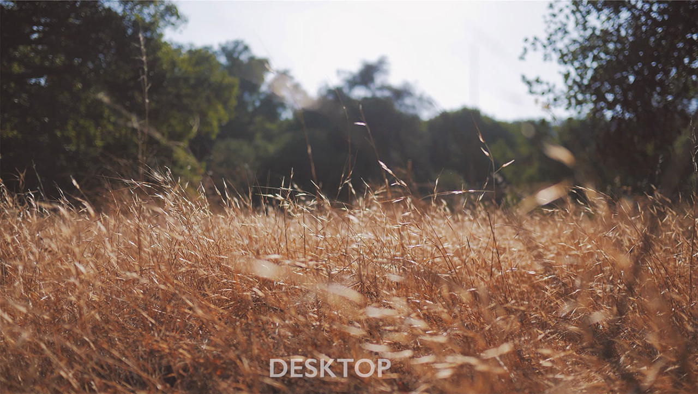

The examples below are here to introduce IxD students to `<srcset>` and the new `<picture>` element. Use is obviously limited across browsers but in time this will become the standard when serving images.

- [Simple Responsive Images](http://eleventhirty.github.io/working-with-images/simple-responsive.html) – using srcset to change the same image to different dimensions to fit the relevant screen.

- [Art Directed Images](http://eleventhirty.github.io/working-with-images/art-directed.html) – changing the image across devices to ensure the viewer receives images appropriate to their device.

**Picturefill** is a “A Responsive Images approach that you can use today, that implements the Editors Draft for the proposed `<picture>` element with srcset and sizes attributes.”

- [Picturefill](https://responsivedesign.is/resources/images/picture-fill)
- [Simple Responsive Images](http://eleventhirty.github.io/working-with-images/simple-responsive.html)
- [Art Directed Images](http://eleventhirty.github.io/working-with-images/art-directed.html)

